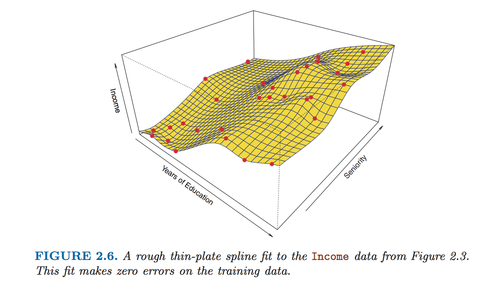

## How do we estimate *f*?

* There are many linear and non-linear approaches to estimation, but they all share some common characteristics.

#### Parametric Methods

* **Parametric** methods involve two steps:

1.) We make an assumption about the form (or shape) of *f*.  One such assumption might be that *f* is **linear** in X, i.e., that *f*(X) = β[0] + (β[1] * X[1]) + (β[2] * X[2]) + ... + (β[p] * X[p]).

2.) Once you make the assumption of the form, you have a **model**, and you can then estimate the needed parameters.  For example, in the **linear model**, you must estimate β[1] ... β[p].

* Parametric models are called that because they reduce estimating *f* to estimating a set of **parameters**.

* The advantage of a parametric approach is it is often much simpler to estimate parameters than to estimate an entirely arbitrary *f*.

* The disadvantage of a parametric approach is that you must make an assumption about the form and this assumption is often not precisely correct, which introduces error.  You also risk being completely off with your assumption, which will produce a large amount of error.

* Some parametric methods are **non-linear**.  These can often be more flexible in fitting *f*, but risk **overfitting**, where the cmoplex model follows the training data too closely and fails to generalize to a wider set of data.

#### Non-parameteric Methods

* **Non-parameteric** methods do not make explicit assumptions about the functional form of *f*.

* Instead, they seek an estimate of *f* that gets as close to the data points as possible without overfitting.

* By avoiding the assumption of a particular form, there is the potential to accurately fit a much wider range of possible shapes for *f*.

* The disadvantage of the parametric method is the main advantage of the non-parametric method -- non-parametric methods avoid the pitfalls that come with making too many assumptions about form.

* However, the advantage of the parametric method is the main disadvantage of the non-parametric method -- non-parametric methods do not reduce estimation down to parameters, which means a relatively much larger number of observations is required to obtain an accurate estimate for *f*.

* An example of a non-parametric approach is a **thin-plate spline**, which fits a *n*-dimensional **hyperplane** to the data points with an arbitrary **smoothness**.

## The Tradeoff Between Prediction Accuracy and Model Interpretability

* Some approaches to estimating *f* are very inflexible, like the linear model.  Other approaches are much more flexible -- way more flexible than even thin-plate splines.

* Flexibility comes with a great benefit -- higher prediction accuracy.  However, it also comes with a great cost -- more flexible models are harder to interpret.

* It's very easy to take a linear model and understand the relationship between the variables.  It is much harder to do so with a thin-plate spline.

## Why so many methods?

* Why are there so many methods for estimating *f*?  Why not one best method?

* The tradeoff between prediction accuracy and model interpretability would suggest we'd want a range of methods, so we can pick our favorite position on the tradeoff.

* However, it's also true that there is no one best method that dominates all others across all possible data sets.  This is called **the "There is no free lunch in statistics" principle**.
