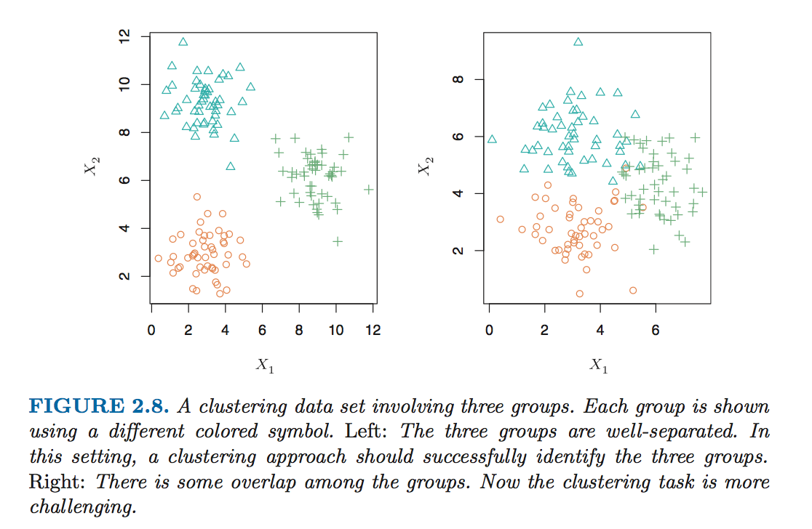

## Clustering

* Parametric and non-parametric methods are still **supervised learning**, where we can learn by training on data that contains our DV.

* However, we still need methods for **unsupervised learning**, where we do not have sufficient data on our DV, or when we're more interested in understanding relationships between variables or observations than making predictions.

* One of these approaches is **clustering**, or identifying groups from data.

