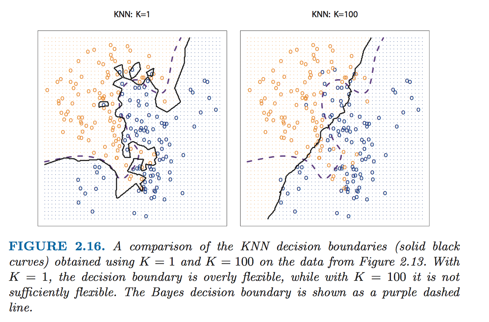

## Clustering

* Parametric and non-parametric methods are still **supervised learning**, where we can learn by training on data that contains our DV.

* However, we still need methods for **unsupervised learning**, where we do not have any train data (with sufficient data on our DV) to learn from.

* With unsupervised learning, we also don't know the conditional distribution of Y given X (that is, how the likelihood of various classifications change when the independent variables change), so we can't compute Bayes classifiers.

* Another reason for **unsupervised learning** is when we're more interested in understanding relationships between variables or observations than making predictions.

* One of these approaches is **clustering**, or identifying groups from data.  Clustering is similar to classification, which we discussed before, except we don't have train data from which to derive probabilities of class membership.  Instead, we just look at the relationships between observations.

#### K-Nearest Neighbors

* The **K-nearest neighbors classifier** will take a point *x*[0] and look at the K nearest points to *x*[0], and will then estimate the likelihood of *x*[0] having a given classification as the proportion of those nearest neighborhoods that have that classificaiton.

* Mathematically, P(Y = *j* | X = *x*[0]) = (1/K)(Σ{*i* ∈ N[0]}(I(*y*[*i*] = *j*))).  N[0] represents the set of K points nearest to *x*[0].

* The choice of K matters a lot.  A low K will have low bias but very high varaince.  A high K will have high bias but low variance.  As K grows, the method becomes less flexible and produces a decision boundary that is close to linear.

* On this simulated data set, neither K = 1 nor K = 100 give good predictions: they have test error rates of 0.1695 and 0.1925, respectively:

* K-Nearest Neighbors also provides a great opportunity to see the differences in training error and test error, as K = 1 (1-Nearest Neighbors) will always have 0% training error, because it is impossible to misclassify any training points.

