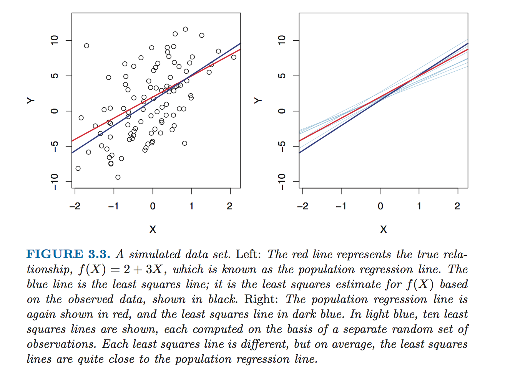

## Linear Regression

* Predicts a quantitative response.
* Useful jumping off point for predictive methods, as many methods are extensions of linear regression.

## Key Questions for Analysis

* Is there a relationship between X and Y?
* How strong is the relationship between X and Y?
* Which x in X contribute to Y?
* How accurately can we determine which x in X contribute to Y?
* How accurately can we predict future Y given future combinations of x in X?
* Is the relationship between X and Y linear?
* Do the x in X affect Y alone, or do particular combinations of x in X produce synergy together (called an **interaction effect**)?

## Simple Linear Regression

* Y ~= β[0] + β[1]*X
* `~=` means "is approximately modeled as".
* β[0] and β[1] are **model coefficients** or **parameters**.
* β^[0] is called the **intercept**.
* β^[1] is called the **slope**.
* Training data lets us estimate β^[0] and β^[1], and we can start predicing that *y*^ = β^[0] + β^[1] * *x*
* *y*^ is a prediction of Y on the basis of X = *x*.
* The `^` symbol indicates the estimated value of an unknown parameter.

## Least Squares Analysis

* In a linar regression, β[0] represents an intercept and β[1] represent a slope.
* This resulting line defined by β is the line that most **closely** matches the training data.
* There are multiple ways of measuring closeness, but the most common one is **least squares analysis**.
* With least squares analysis, we calculate *y*^[*i*] = β^[0] + β^[1] * *x*[*i*] for each *x*[*i*] in X.
* *e*[*i*] = *y*[*i*] - *y*^[*i*] (estimated - actual) for each *x*[*i*] in X.  *e* is then the set of **residuals**.
* The **residual sum of squares** (RSS) is the sum of the squared residuals.  RSS = Σ{*i*=1 -> *n*}(*e*[*i*]^2).

## Estimating β^

* β^[0] = mean(*y*) - β^[1] * mean(*x*)
* β^[1] = (Σ{*i*=1 -> *n*}((*x*[*i*] - mean(*x*))(*y*[*i*] - mean(*y*))))/(Σ{*i*=1 -> *n*}((*x*[*i*] - mean(*x*))^2)
* mean(*x*) refers to the **sample mean** of *x*, or (1/n)Σ{*i*=1 -> *n*}(*x*[*i*]).

## Interpreting β^

* Given that Y ~= β[0]^ + β[1]^*X, we estimate that for every increase of 1 in X, we predict there will be a corresponding β[1]^ increase in Y.  Also, when X = 0, we predict Y will be β[0]^.

## Assessing the Accuracy of β^

* The line given by Y = β[0] + β[1]*X + *e* is the **population regression line**, or the line that most closely resembles the relationship (given perfect data).
* The line given by Y^ = β[0]^ + β[1]^*X is the **least squares line**, or the line that best predicts the relationship using least squares analysis on the data we have.

