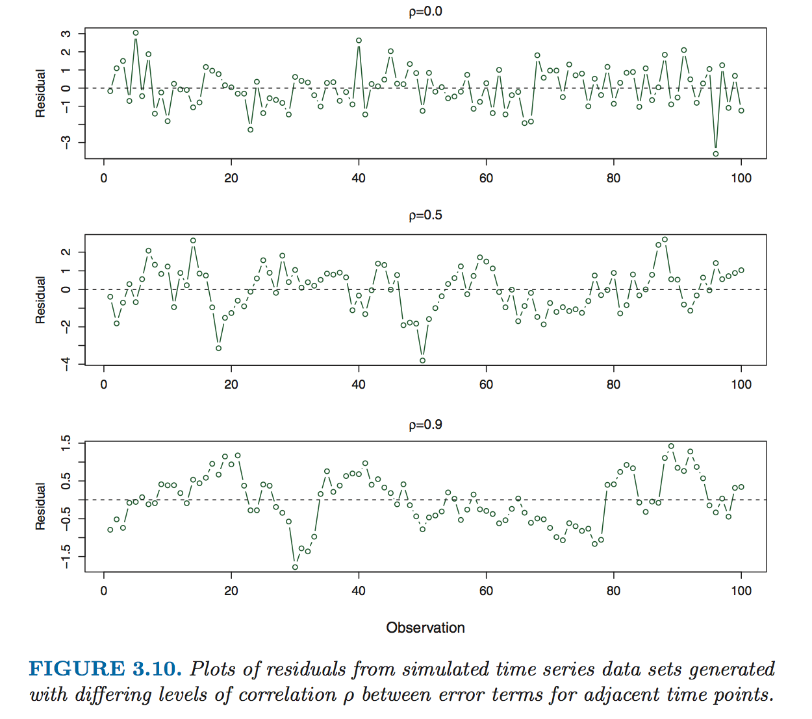
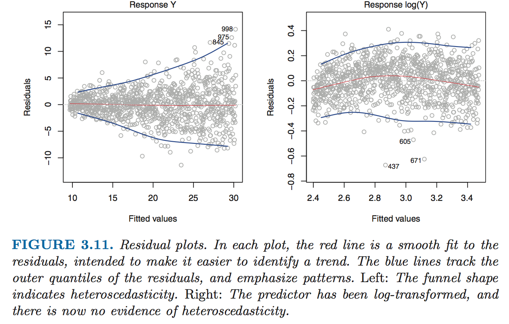
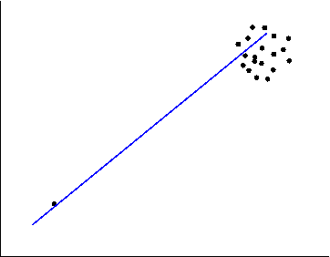

## Potential Problems in Fitting a Linear Model

Six key problems:

* Non-linearity of response-predictor relationships
* Correlation of error terms
* Non-constant variance of error terms
* Outliers
* High-leverage points
* Colinearity

## Dealing with Non-Linearity

* The linear model assumes there is a straight-line relationship between the predictors and the response.  If this is false, the predictive power of the model is greatly reduced.  This is called **non-linearity**.
* To detect non-linearity, we look at **residual plots**, or plotting the residuals against the predicted values of Y^[*i*].  A problem with non-linearity will manifest itself as a relationship between the residuals and Y^[*i*], which will be shown in the residual plot.
* The best way to correct this problem is to either (a) switch to a different method of prediction other than the linear model or (b) add additional variables that act as transformations of various predictors, such as log(X), sqrt(X), or X^2.

On the left, there is no relationship between the resudial and the variable, which means the linear relationship looks correct.  However, on the right graph, there is a strong linear relationship between the residuals and the variable, which suggests the assumption of a linear relationship between the variable and the DV is not correct.

## Dealing with Correlated Error Terms

* Remember that Y = β[0] + β[1]X[1] + β[2]X[2] really means Y = β[0] + β[1]X[1] + β[2]X[2] + *e*, where *e* is a set of error terms.  *e*[*i*] is the error term for an individual observation, coming from Y[*i*] = β[0,*i*] + β[1,*i*]X[1,*i*] + β[2,*i*]X[2,*i*] + *e*[*i*].
* If *e*[*i*] for various *i* are correlated within *e*, then many of the assumptions of linear models are broken, leading to wrong calculations of statistical significance and wrong confidence intervals.
* For example, consider what would happen if we accidentally duplicated our data, so data and error terms are identical in pairs.  This would lead us to calculate statistical significance and confidence intervals with a sample size of 2*n*, when we should have calculated with just *n*.
* Correlated error terms can exist when sampling from correlated populations (e.g., multiple members of the same family are sampled) or in **time-series data**, where samples at certain points in time are frequently correlated with the same sample taken just before.
* A way to detect correlations of residuals in time-series data is to plot the residuals against time and look for patterns.

## Dealing with Non-constant Variance of Error Terms

* Another key assumption of linear models is that Var(*e*) = σ^2, or that the variance of each error term is constant.
* Frequently, however, this assumption is incorrect in actual data.  The presence of non-constant variance of error terms is called **heteroscedasticity**.
* Like all problems so far, this also can be diagnosed by looking at the residual plot.  In this case, you're looking for a funnel shape.
* A frequent solution to heteroscedasiticity is to add a **logarithmic transformation**, which means including log(X) in the linear model.
* Another solution is to use **weighted least squares**, where you multiply each term by a weight while calculating the squared error.  The weight, in this case, is (σ^2)/*n*[*i*], where *n*[*i*] is the number of raw observations in the *i*th response.  (σ^2)/*n*[*i*] comes from the assumption that the overall variance of the errors should be σ^2.
* It's important to remember that adding this log(X) term, or taking other remedies, likely won't make your model perform better on test metrics like R^2.  Instead, it will make the calculation of R^2 more accurate.

## Dealing with Outliers

* An **outlier** is a point for which the value of the point (y[*i*]) is far from the predicted value for the point (y^[*i*]).
* Outliers arise for a variety of reasons.  One of the most common reasons is simply incorrectly recording data.
* The solution to outliers is to remove them from the dataset and re-run the regression.
* However, determining outliers from legitimate points can be a challenge.
* Again, the solution is to look to residual plots.  The outlier should be visible there as well.
* Another solution is to use **studentized residuals**, computed by dividing each residual *e*[*i*] by its estimated standard error. Observations whose studentized residuals are greater than 3 in absolute value are possible outliers.

## Dealing with High Leverage Points

* Outliers have an unusual y-value.  A **high-leverage point** has an unusual x-value.
* High-leverage points tend to have very sizable influence on the regression.

The point to the far bottom-left of this graph is both an outlier (unusual y-value) and a high-leverage point (unusual x-value).  This single point turns a random data set into a data set that has a strong linear relationship.  However, this relationship is erroneous.  Detecting and removing extreme points like this is important.

* While high-leverage points can be identified through residual plots, it can be quite difficult to determine them in multiple regressions with lots of variables.
* Instead, we can detect high-leverage points by calculating the **leverage statistic** for each point, which is *h*[*i*] = (1/*n*) + (((*x*[*i*] - mean(*x*))^2)/(Σ{j=1 -> *n*}((*x*[j]-mean(x[*j*])^2)))).  This statistic can be extended for multiple predictors.
* *h*[*i*], the leverage statistic, clearly increases as *x*[*i*] gets further from mean(*x*).  The statistic is always between 1/*n* and 1, and the average leverage statistic is always (*p* + 1)/*n*.
* An observation with *h*[*i*] greatly exceeeding (*p* + 1)/*n* has high leverage.
