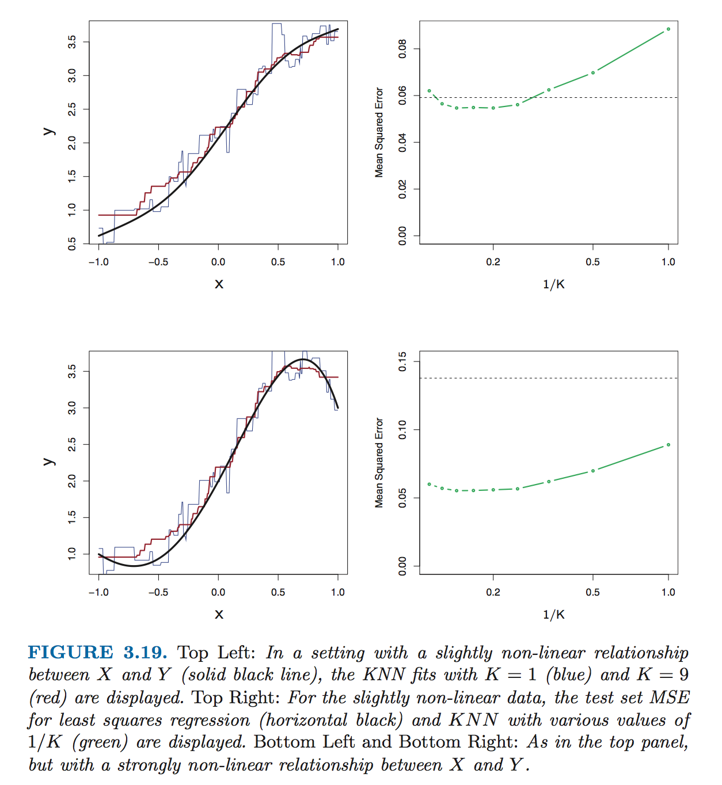

## K-Nearest Neighbors Regression

* Closely related to the K-Nearest Neighbors Classifier discussed earlier.
* Given a point *x*[0] and a value K, KNNR identifies the K nearest points to *x*[0] (called *N*[0]) and then estimates KNNR(*x*[0], N) as the average of *N*[0].
* That is, KNNR(*x*[0], N) = (1/K)(Σ{*x*[i] in *N*[0]}(*y*[i]).
* Optimal value for N depends on the bias-variance tradeoff.
* KNNR can fit a wide variety of relationships reasonably well.
* KNNR tends to do really well with small number of variables (i.e., *p* < 3) and linear regression does much better with larger numbers of variables (i.e., *p* > 4).  This is because additional variables spread out the number of observations into too many dimensions, preventing nearest neighbors from being all that near.  This is called **the curse of dimensionality**.

