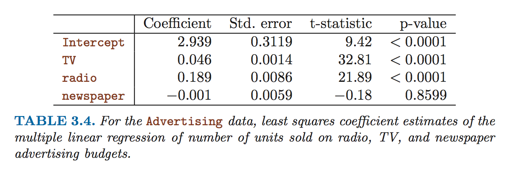

**1.) Describe the null hypotheses to which the p-values given in Table 3.4 correspond. Explain what conclusions you can draw based on these p-values. Your explanation should be phrased in terms of sales, TV, radio, and newspaper, rather than in terms of the coefficients of the linear model.**

* The null hypothesis is that no combination of TV, radio, or newspaper advertising will influence sales.  That is Sales = TV*0 + Radio*0 + Newspaper*0 + Intercept, or Y = Intercept.
* The first p-value, that the Intercept has *p* < 0.0001, shows that TODO: ???.
* The second p-value, that TV has *p* < 0.0001, shows that we can reject the null-hypothesis and conclude that TV has an impact on Sales, when holding Radio and Newspaper advertising constant.
* The third p-value, that Radio has *p* < 0.0001, shows that we can reject the null-hypothesis and conclude that Radio has an impact on Sales, when holding TV and Newspaper advertising constant.
* The fourth p-value, that Newspaper has *p* < 0.0001, shows that Newspaper does not have an impact on Sales, when holding TV and Radio advertising constant.

-

**2.) Carefully explain the differences between the KNN classifier and KNN regression methods.**

The KNN classifier seeks to *classify* a result into qualitative groups based on using the most common group found among the K nearest neighbors.  The KNN regression seeks to make a quantitative estimate by averaging the result of the K nearest neighbors.

-

**3.) Suppose we have a data set with five predictors, X[1] = GPA, X[2] = IQ, X[3] = Gender (1 for Female and 0 for Male), X[4] = Interaction between GPA and IQ, and X[5] = Interaction between GPA and Gender. The response is starting salary after graduation (in thousands of dollars). Suppose we use least squares to fit the model, and get β^[0] = 50, β^[1] = 20 , β^[2] = 0.07, β^[3] = 35, β^[4] = 0.01, β^[5] = −10.**

**(a) Which answer is correct, and why?**

**i. For a fixed value of IQ and GPA, males earn more on average than females.**

Let's reorganize the equation to Salary = 50 + 20 * GPA + 0.07 * IQ + 35 * Female + 0.01 * GPA * IQ - 10 * GPA * Female.

We now can estimate that men earn an average of 50 + 20 * mean(GPA) + 0.07 * mean(IQ) + 0.01 * mean(GPA) * mean(IQ) and women earn an average of 50 + 20 * mean(GPA) + 0.07 * mean(IQ) + 35 + 0.01 * mean(GPA) * mean(IQ) - 10 * mean(GPA).  When you subtract out the common terms, you find out that women earn an average of 35 - 10 * mean(GPA) more than men.  Since we don't know the value of mean(GPA), we don't know whether men are outearning women on average or not.

**ii. For a fixed value of IQ and GPA, females earn more on average than males.**

Again, this is indeterminate.

**iii. For a fixed value of IQ and GPA, males earn more on average than females provided that the GPA is high enough.**

Since women are earning an average of 35 - 10 * mean(GPA) more than men, a higher GPA mean means that women earn less than men, so this is false.

**iv. For a fixed value of IQ and GPA, females earn more on average than males provided that the GPA is high enough.**

Since women are earning an average of 35 - 10 * mean(GPA) more than men, a higher GPA mean means that women earn less than men, so this is true.

**(b) Predict the salary of a female with IQ of 110 and a GPA of 4.0.**

We estimate that women earn an average of 50 + 20GPA + 0.07IQ + 35 + 0.01(GPA * IQ) - 10GPA.  Plugging in the given values yields 50 + 20 * 4 + 0.07 * 110 + 35 + 0.01 * 4 * 110 - 10 * 4, which is 137.1.  Since the unit was in 1000s of dollars, we predict a post-grad salary of $137,000.  Wow!

**(c) True or false: Since the coefficient for the GPA/IQ interaction term is very small, there is very little evidence of an interaction effect. Justify your answer.**

This is false, because the statistical significance of an interaction is different from the magnitude of the interaction.  It's possible to have a lot of evidence for a small (but existant!) effect.  Also, a small coefficient doesn't even mean the interaction effect is small, since it is very sensitive to the units of the two variables.

-

**4.) I collect a set of data (n = 100 observations) containing a single predictor and a quantitative response. I then fit a linear regression model to the data, as well as a separate cubic regression, i.e. Y = β[0] +β[1]*X* +β[2]*X*^2 +β[3]*X*^3 + *e*.**

**(a) Suppose that the true relationship between X and Y is linear, i.e. Y = β[0] + β[1]*X* + *e*. Consider the training residual sum of squares (RSS) for the linear regression, and also the training RSS for the cubic regression. Would we expect one to be lower than the other, would we expect them to be the same, or is there not enough information to tell? Justify your answer.**

If the true relationship is linear, than the introduction of the cubic regression would merely introduce excess noise.  Therefore, we would expect the training RSS to be lower for the cubic regression than the linear regression.

**(b) Answer (a) using test rather than training RSS.**

We would also expect the test RSS to be lower for the cubic regression than the linear regression.  We expect this with even higher confidence because it's possible that the training subpopulation was skewed to be more cubic by random chance, whereas in the test population this would not necessarially be the case.

**(c) Suppose that the true relationship between X and Y is not linear, but we don’t know how far it is from linear. Consider the training RSS for the linear regression, and also the training RSS for the cubic regression. Would we expect one to be lower than the other, would we expect them to be the same, or is there not enough information to tell? Justify your answer.**

We don't have enough information to know.  It's possible that the cubic relationship could capture some of this non-linearity, but it depends on the nature of the relationship.

**(d) Answer (c) using test rather than training RSS.**

There's also not enough information to know.

-

**5.) Consider the fitted values that result from performing linear regression without an intercept. In this setting, the *i*th fitted value takes the form where *y*^[i] = *x*[i]β^[i] where β^ = (Σ{i = 1 -> *n*}(*x*[i]*y*[i]))/(Σ{*j* = 1 -> *n*}(*x*[*j*]^2)).  Show that we can write *y*^[i] = Σ{*j* = 1 -> *n*}(*a*[*j*]*y*[*j*]).  What is *a*[*j*]?**

*y*^[i]

= *x*[i] * (Σ{*i* = 1 -> *n*}(*x*[*i*]*y*[*i*])) / (Σ{*j* = 1 -> *n*}(*x*[*j*]^2))

= *x*[i] * (Σ{*i* = 1 -> *n*}((*x*[*i*]*y*[*i*])/*x*[*i*]^2))

= *x*[i] * (Σ{*i* = 1 -> *n*}( (1/*x*[*i*]^2) * *x*[*i*] * *y*[*i*] )

= Σ{*i* = 1 -> *n*}( (1/n) * *x*[*i*] * (1/*x*[*i*]^2) * *x*[*i*] * *y*[*i*])

= Σ{*j* = 1 -> *n*}(*a*[*j*]*y*[*j*]) where *a*[*j*] = (1/*n*) * *x*[*j*] * (1/*x*[*j*]^2) * *x*[*j*]

= Σ{*j* = 1 -> *n*}(*a*[*j*]*y*[*j*]) where *a*[*j*] = *x*[*j*] * (1/*n**x*[*j*]^2) * *x*[*j*]

= Σ{*j* = 1 -> *n*}(*a*[*j*]*y*[*j*]) where *a*[*j*] = (1/*n**x*[*j*]^2) * *x*[*j*]^2

= Σ{*j* = 1 -> *n*}(*a*[*j*]*y*[*j*]) where *a*[*j*] = (*x*[*j*]^2) / (*n**x*[*j*]^2)

= Σ{*j* = 1 -> *n*}(*a*[*j*]*y*[*j*]) where *a*[*j*] = *n*

-

**6.) Given that:**

**β^[0] = mean(*y*) - β^[1] * mean(*x*)**

**β^[1] = (Σ{*i*=1 -> *n*}((*x*[*i*] - mean(*x*))(*y*[*i*] - mean(*y*))))/(Σ{*i*=1 -> *n*}((*x*[*i*] - mean(*x*))^2))**

**...argue that in the case of simple linear regression, the least squares line always passes through the point (mean(*x*), mean(*y*)).**

-

**7.) It is claimed in the text that in the case of simple linear regression of Y onto X, the R2 statistic is equal to the square of the correlation between X and Y. Prove that this is the case. For simplicity, you may assume that mean(*x*) = mean(*y*) = 0.**

