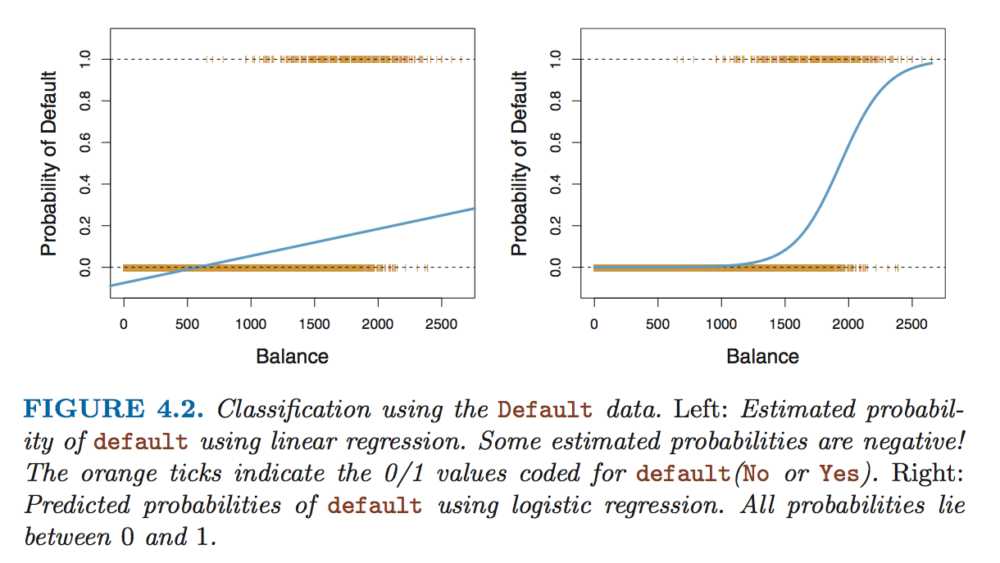

## Linear Regression

* If we're predicting just between two labels, we can use linear regression.
* The output would be a crude estimate of the probability of fitting the the label, and we could use a cutoff threshold to determine which label the prediction is for.
* However, the results of linear regression may return values outside [0, 1], which are hard to interpret into probabilities.

## Logistic Regression

* **Logistic regression** solves this problem by only giving values between 0 and 1.

## The Logistic Regression Function

* Linear regression used the equation Y = β[0] + β[1] * X.
* Logistic regression uses the **logistic function**, Y = (*e*^(β[0] + β[1] * X)) / (1 + e^(β[0] + β[1] * X)).

## Log Odds

* A logistic regression can also be represented as *t*(Y) = β[0] + β[1] * X, where *t* is a transformation function.
* Y / (1 - Y) = *e*^(β[0] + β[1] * X).
* Y / (1 - Y) is called the **odds**, which is a value between 0 and infinity, with odds close to 0 indicating incredibly low probabilities and higher odds indicating higher probabilities.
* For example, an odds of 0.25 is equivalent to a 20% chance, since 20%/(1 - 20%) = 0.25.  An odds of 9 is equivalent to a 90% chance, since 90%/(1 - 90%) = 9.
* Odds aren't used very often, but they are used in horse racing, since they more naturally correspond with the optimal betting strategy.
* The reason why odds are important is because of **log odds**, or the logarithm of the odds.  Log odds is abbreviated as "logit".
* Log odds are the *t* mentioned earlier.  That is, logit = log(Y / (1 - Y)) = β[0] + β[1] * X.

## The Relationship Between X and Log Odds

* In a linear regression, β[1] represents the change in Y with a one-unit increase in X.
* In a logistic regerssion, β[1] represents the change in logit with a one-unit increase in X.  This corresponds to multiplying the odds by *e*^(β[1]).
* It is not possible in a logistic regression to find the change in Y with a one-unit increase in X, since the change in Y will be depedent on the current value of X.
